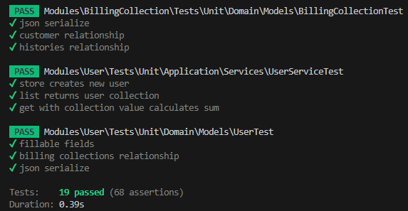

# Test Collections

## Dados técnicos

```
PHP: 8.4
Laravel: 12
Mysql: 8.0
Nginx: 1.25
```


## Configuração

### Copiar arquivo .env

Faça uma cópia dos arquivos `.env.example` para `.env` que estão na raiz do projeto


### Subir docker

```
docker-compose up -d --build
```

Obs: Estas máquinas tem que estar rodando:<br>


### Instalar dependências

```
docker-compose exec app composer install
```

### Migrar banco de dados

```
docker-compose exec app php artisan migrate
```

### Adicionar permissão para a pasta storage

```
sudo chmod 777 -R storage/
```

## Comandos extras

### Executar testes

```
docker-compose exec app composer test
docker-compose exec app composer test:mutation
```

Testes:<br>


Teste mutation:<br>

